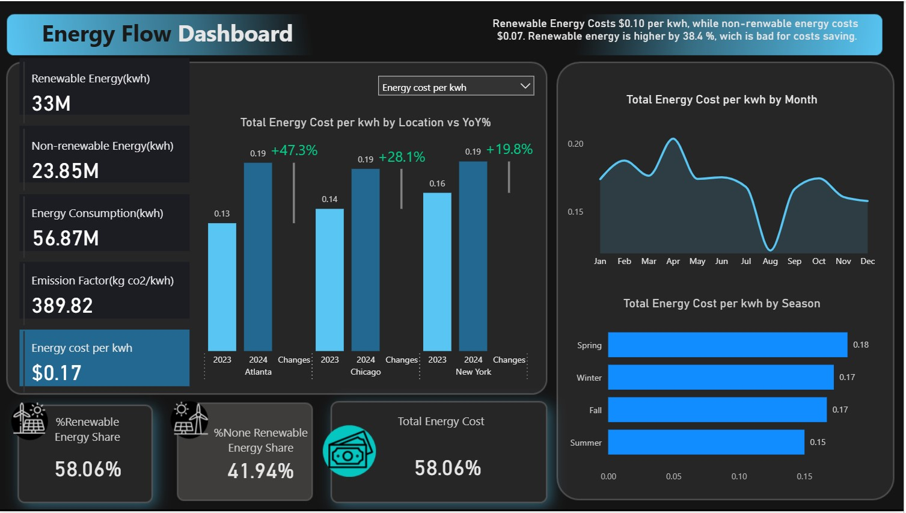
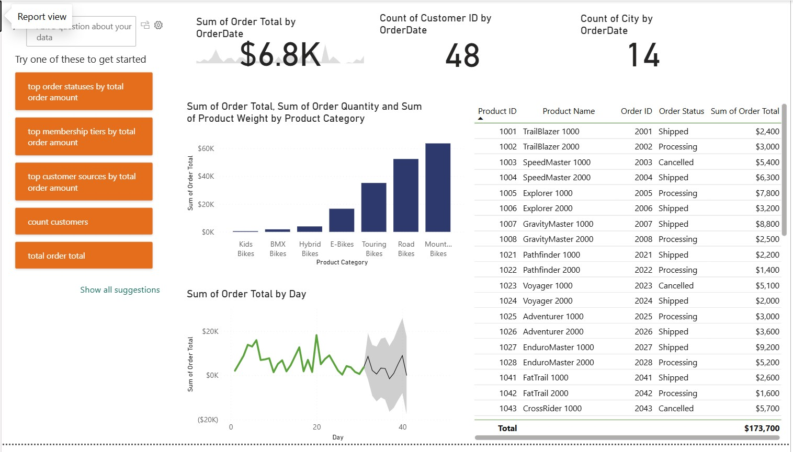
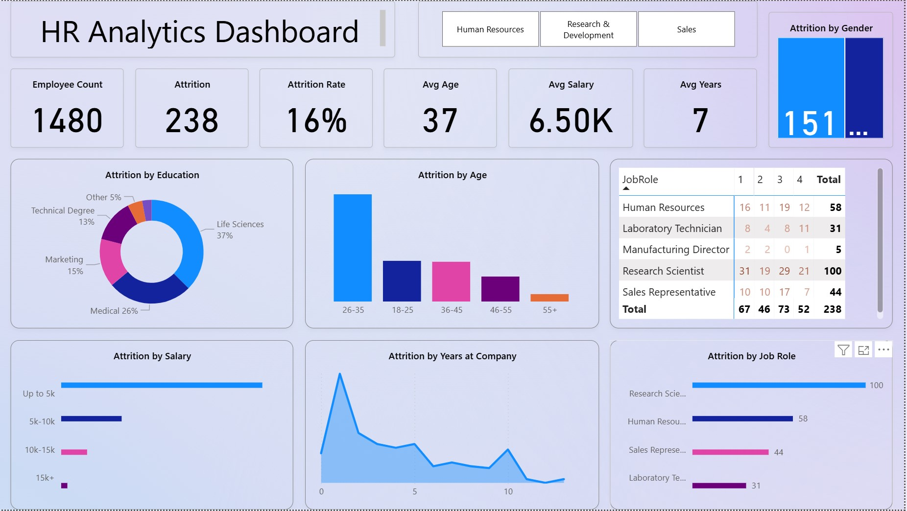

# Energy Flow Dashboard
This project is a Power BI dashboard designed to provide insights into energy consumption, cost efficiency, and emissions. It compares renewable and non-renewable energy usage while highlighting trends over time, by location, and by season.

---
## 📌 Project Background
Energy data from multiple locations often lacks a unified, actionable view for decision-making. This dashboard consolidates key metrics—such as energy usage, cost per kWh, and emissions—into a single, interactive report. It enables stakeholders to evaluate cost differences between renewable and non-renewable sources and to identify seasonal and regional patterns affecting overall efficiency.

---
## 📊 Dashboard Objectives

✅ Compare renewable and non-renewable energy usage and costs
✅ Analyze energy costs by location, month, and season
✅ Highlight cost differences between energy types
✅ Track total consumption and emissions

A sample screenshot of the dashboard:

---
## 📁 Files Included
- `Energy Consumption/Energy Flow Dashboard.pbix` — Main Power BI file
- `./Energy Consumption/Screenshot .jpg` — Image preview of the dashboard
- `./data/` — (Optional) Data files if external datasets were used

# Adventure Works Executive Summary Dashboard

This project is a Power BI dashboard built as part of a Coursera course exercise using the Adventure Works dataset. It provides a high-level executive summary of sales, customer orders, and product performance.

---
## 🧠 Project Background

The executive team at Adventure Works are surrounded by fragmented reports and need a unified, actionable view of sales, customer behavior, and inventory to support high-stakes strategic decisions.

My task: build a comprehensive Power BI dashboard that transforms scattered data into meaningful insights. This dashboard is intended for executive-level use and must highlight critical KPIs, trends, and patterns in a simple, accessible way.

---

## 📊 Dashboard Overview

The dashboard provides insights into:

- ✅ **Total Order Value**
- 👥 **Number of Unique Customers**
- 🌍 **Orders by City**
- 📦 **Orders by Product Category**
- 📅 **Trend of Orders Over Time**
- 📄 **Detailed Order Table with Status**

A sample screenshot of the dashboard:

---

## 📁 Files Included

- `AdventureWorksDashboard.pbix` — Main Power BI file
- `./AdventureWorks/DashboardScreenshot.jpg` — Image preview of the dashboard
- `./data/` — (Optional) Data files if external datasets were used

---

## 📌 Data Source

The dashboard is based on the [Adventure Works sample dataset](https://learn.microsoft.com/en-us/power-bi/sample-datasets/adventure-works) — a common dataset for Power BI practice.

---

## 🛠 Tools Used

- **Power BI Desktop**
- **DAX (Data Analysis Expressions)**
- **Data Modeling**
- **Visualizations: Cards, Bar Charts, Line Charts, Tables**

___

## 📊 HR Analytics Dashboard

This project explores employee attrition patterns across age, salary, education, and job role dimensions using Power BI.

🔗 [View project folder](./HR_Analytics/HR Analytics.pbix)

A sample screenshot of the dashboard:

---
## 📌 Data Source

The dashboard is based on the [HR sample dataset](HR_Analytics/HR_Data.xlsx) — a common dataset for Power BI practice.

---
### ## 🛠 Tools Used
- Power BI Desctop
- Cleaned and transformed raw HR data (handled missing values, reformatted columns, standardized categorical variables)
- Created calculated columns and DAX measures to support interactive visuals
- Enabled dynamic filtering by department and gender
- Visualizations: Cards, Bar Charts, Line Charts, Tables

This dashboard enables HR and executives to identify trends and insights that can inform workforce planning and retention strategies.
